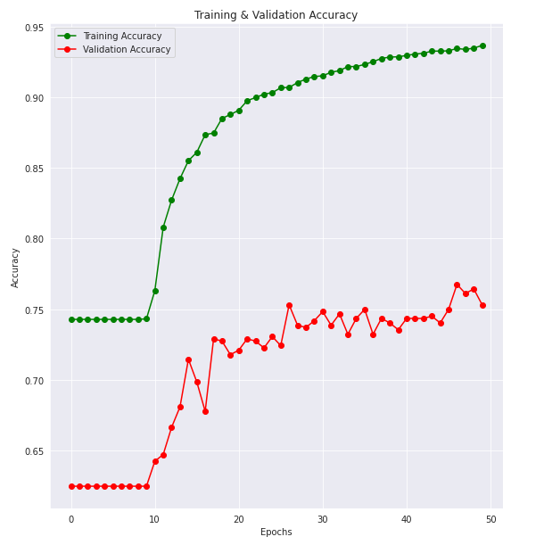

# CS 7641 Machine Learning Project: Classification of Chest X-ray with Pneumonia

## Introduction

Pneumonia is a respiratory infectious disease affecting the lungs. It is the leading cause of under 5-year-old child death worldwide, killing over 800,000 children in 2017, and accounting for 15% of the deaths in children this age [1]. In the US, it causes about 1 million adult hospitalizations each year and is the leading cause of child hospitalization [2]. Chest X-Ray is currently the best tool available for diagnosing the disease. 

However, it is still a challenging task for a trained professional because the X-ray images are often obscure and hard to distinguish from other lung-related diseases. [Research](https://www.sciencedaily.com/releases/2010/10/101022123749.htm)  has the following three observations. First, it shows that 72 per cent of patients were misdiagnosed with Pneumonia when they were readmitted to the same hospital. Second, 72 per cent of the misdiagnoses occurred in the Emergency Department, where physicians are likely under high pressure. Therefore, there is a pressing need to develop diagnostic tools that help physicians to distinguish patients with Pneumonia from normal people, especially for those at the Emergency Unit who have to make diagnostic decisions under time pressure. Thus, we hope to use the knowledge gained in this Machine Learning class to build a model that would help to diagnose Pneumonia.

Proposal video: https://youtu.be/wwyKnWuLHiE

## Problem Definition

We are trying to solve the problem of diagnosing patients with Pneumonia, given their Chest X-Ray image. Since each image can be classified into the ‘Pneumonia’ class or the ‘Normal’ class, we are treating this as a binary classification problem. The inputs are the frontal chest X-ray images and the outputs are binary predictions (0 or 1), corresponding to the probabilities of the ‘Normal’ and ‘Pneumonia’ classes respectively. Previous research has favored the use of CNN [3, 4] for X-ray image classification. Our project aims to compare the performance of CNN to other models such as SVM and ANN. We will accomplish this using both supervised and unsupervised learning.

## Data Collections & Preprocessing

We have collected a dataset from [Kaggle](https://www.kaggle.com/paultimothymooney/chest-xray-pneumonia), consisting of 5,863 greyscale chest X-Ray images with labels of 'NORMAL' and 'PNEUMONIA' in various sizes (usually with dimensions of around 1000x600). The labels indicate whether the patients with certain X-Ray images are diagnosed with Pneumonia or not. The diagnostic labels for the images were verified by expert physicians.

About the Dataset: The images were selected from retrospective cohorts of pediatric patients from the Guangzhou Women and Children's Medical Center in Guangzhou, China. The images are Chest Radiographs that were obtained during routine clinical care, which was then screened for quality control.

### Exploratory Data Analysis
Among the images that we get, 1,583 are images of normal lungs, while the remaining 4,273 are Pneumonia. To help visualize the size of the training, validation and test datasets and the distribution of the classes within them, we made the bar charts shown below:

Since the validation dataset contains only 16 images in total, we did not use it in this project. Any time cross-validation was done, it was done using the train and test datasets.

The images are in grayscale. Below is the sample of data that we have in its original shape.

Since we need to feed data of the same dimension to the model, we resize all images as shown in the sample below.

Comparing the mean of each class, we can see that pneumonia images tend to be more opaque. This gives us some idea of the difference between the two classes.

The correlation matrix of each pixel of each image (resized to 64x64) is as shown in the plot below.

### Principal Component Analysis

We trained PCA using 4,096 original features from the resized images (64x64), then used it to train the Logistic Regression and SVM models in comparison to training both models using the original features. The resulting components have the variance in data retained as shown in the plot below. 

From a more closed up graph below, we can see that 90% of the variance is captured by the first 200 components.

### Convolutional Autoencoder
A Convolutional Autoencoder is used as a pre-processing step to encode the data to see if it helps improve the performance of the Artificial Neural Network. Using this model, we were able to encode the information of [64, 64, 3] images into [2, 2, 128] latent vectors. It is described in detail in a later section.

## Overview of Our Analytical Approaches
Our approach is to adopt an arsenal of classification ML models to classify the Pneumonia chest X-Ray images and compare their performance based on selected metrics. Since the major problem in our case is the misdiagnosis, this approach can greedily search for the most accurate model for X-Ray classification by training the validating them with the same dataset. Our approach is novel in terms of diversity and exhaustiveness of comparison of models in the domain of medical image classification. In particular, we venture to adopt a gradient boosting model, which is rarely used in classifying image data. It is our hope to find the 'global optimal model' to classify X-Ray images with our exhaustive comparison approach.

### Unsupervised Learning
Given that we are dealing with an image dataset with high dimensions, we decided to use unsupervised learning methods to preprocess to improve the learning and performance of some supervised learning models. As discussed in the previous section, we used Principal Components Analysis to perform dimensionality reduction of the dataset before feeding them into Logistic Regression and SVM. We also used a Convolutional Autoencoder to encode the images into a compact latent representation before feeding it to one of our Artificial Neural Networks.

### Supervised Learning
We have decided to approach this problem as an Image Classification problem to classify Chest X-Ray images as positive or negative for Pneumonia. We trained a standard CNN, performed hyperparameter optimization and compared it to the performance of classic CNN architectures such as AlexNet, VGG-16, GoogLeNet etc. Moreover, we also trained other models such as ANN, SVM, XGBoost, Logistic Regression, and KNN on original and compact representations of the input images. The compact representation is obtained using unsupervised learning techniques.

## Model Implementation and Results
### Logistic Regression
Fitting the original features to Logistic Regression, we get the following accuracy score: -
- Training Set Accuracy: 99.6%
- Validation Set Accuracy: 74.8%

Then we train another Logistic Regression model using features received from PCA. As we add more components to the model, the accuracy score is as shown in the plot below. We can see that Logistic Regression starts to overfit training data when using more than 10 components. Using 10 principal components, Logistic Regression reaches its best performance at
- Training Set Accuracy: 82.9%
- Test Set Accuracy: 83.5%

### Support Vector Machine
We repeat the process that we have done with Logistic regression to the SVM model. Fitting the SVM model using original features yields a very good training set accuracy but below-par testing accuracy.
- Training Set Accuracy: 98.2%
- Validation Set Accuracy: 76.1%

We then train the model again using PCA generated features. The resulting accuracies score using a different number of components are as shown in the plot below. From the plot, SVM seems to reach overfitting a lot faster than logistic regression. The best SVM performance is achieved using 5 principal components, which yield the following accuracy score.
- Training Set Accuracy: 88.5%
- Validation Set Accuracy: 82.1%

### K-Nearest Neighbors
We also ran a K-Nearest Neighbors (KNN) model as one of our simpler supervised learning models, which serves as a good base model to compare other models to. This algorithm relies on the distance between feature vectors and classifies unknown data points by finding the most common class among the k-closest examples. We used Euclidean distance for simplicity when comparing similarities in images. 

To build this model, we resized each training image to a fixed width and height of 64x64 pixels and flattened the RGB pixel intensities into a single list of numbers. We also constructed and normalized a color histogram to characterize the color distribution of each image. 

Both pixel intensity and color histogram KNN models were trained and validated on a validation set to determine optimal k-neighbors for the models between values 1 and 50. The optimal number of neighbors was 6 and 10 respectively. When using each model on the test data, the raw pixel intensity model gave us an accuracy of 77.24% and the color histogram model gave us an accuracy of 75.64%. This result shows that the models were effective to some extent since they performed better than just randomly guessing each image's classification. However, we could gain better accuracies using other models. 

### Artificial Neural Network
We train the images on a simple neural network consisting of 2 hidden layers with 6 neurons and 1 respectively.

Each hidden layer uses a Leaky ReLU activation function and the output layer uses a Sigmoid function to classify between two categories Pneumonia/Normal. We optimize our model using Stochastic Gradient Descent.

Using a batch size of 128 and 50 epochs we were able to achieve these results

- Training Accuracy: 94.6% vs Test Accuracy: 75.4%
- Training Losses: 1.0832 vs Test Losses: 1.352

### Artificial Neural Networks with a Convolutional Autoencoder
We used a Convolutional Autoencoder to learn a latent representation for the Chest X-Ray images that is compact. A convolutional autoencoder consists of an encoder network and a decoder network. The encoder performs consecutive convolution and max-pooling operations to learn a compact representation of each image. So we go from having [64,64,3] images to a [2,2,128] latent representation. The decoder network performs consecutive deconvolution operations to reconstruct the [64,64,3] output given a [2,2,128] latent representation. The architecture of the Convolutional Autoencoder is shown below:

Once we have learned a latent representation for the images, we flatten the [2,2,128] latent representation to get a [512,1] vector. This is passed into a 10 layer fully-connected neural network, with Batch Normalization to suppress any vanishing or exploding gradients, and Dropout to prevent overfitting. The architecture of the ANN is shown below:

The loss function used was Binary Crossentropy. The optimizer used was Adam. The performance metrics are listed below:
- Training Set: Accuracy = 98%
- Testing Set: Accuracy = 81.7%, Precision = 78.75%, Recall = 96.92%, F1-score = 86.89%

The training and validation accuracy and loss curves are shown below:

We observed that using the latent representation of each image to train a deeper ANN gave better performance than training a shallow ANN on raw images.
While we were able to achieve decent accuracy on the training set, this highlights the limitations of using a simple neural network on images. We consider every pixel to be a feature, thus causing us to overfit and do poorly on the test set compared to the training set

### Convolutional Neural Networks

#### Our Custom CNN
We trained a customized CNN on the dataset. We performed hyperparameter tuning, where we experimented with different values for hyperparameters like the number of convolutional layers, the number of fully-connected layers, the number of filters in each convolutional layer, the number of units in each fully connected layer etc. We used Batch Normalization after every convolutional layer to alleviate any potential vanishing or exploding gradients. We applied Dropout to the activations of all fully-connected layers (except the last output layer) to prevent overfitting. The output layer has only 1 unit with a sigmoid activation function, so its activation can be interpreted as the probability of the positive class p(y = 1) (Pneumonia). The architecture of this CNN is shown below (it was made using NN-SVG). Since this is not a detailed visualization (it does not show layers without parameters like BatchNorm, MaxPool, Flatten, Dropout, etc.), one can refer to the 'custom_model_summary.txt' file in folder "CNN_model_summary" for more detail.

The loss function used was Binary Crossentropy. The optimizer used was Adam (Adaptive Moment Estimation). To achieve faster convergence during training, we employed techniques like reducing the learning rate on plateaus and early stopping. The performance metrics are listed below:
- Training Set: Accuracy = 98%
- Testing Set: Accuracy = 94.07%, Precision = 93.37%, Recall = 97.4%, F1-score = 95.36%

The training and validation accuracy and loss curves are shown below:

#### Pretrained AlexNet
We apply the technique of transfer learning by loading the AlexNet model with pretrained parameters and adding an extra fully connected layer as the last layer. The newly added layer generates a tensor output of 2 channels, representing the pre-normalized probability distribution over the 2 classes (Normal and Pneumonia). All the parameters in other convolutional and fully connected layers are frozen, i.e. they will not be updated in our training. Only the parameters in the last classifier layer will be updated in the back-propagation. The architecture of the modified AlexNet is visualized below, while the detailed model summary can be viewed in the 'custom_model_summary.txt' file in folder "AlexNet_model_summary.txt". 

Note that since there is only one unfrozen linear classifier layer (last layer), the total number of trainable parameters are 2002.

In order to avoid overfitting, we apply augmentation transformation to the training dataset. In addition, since we are directly adopting the architecture of AlexNet, which includes Dropout Layers in the classifier, its inherent structure also regularizes the network itself and prevent overfitting to the training dataset.

The training starts with adjusting the degree of augmentation transformation, learning rate, types of optimizer and all different hyperparameters (momentums and weight decay). In the initial training, we used barely any augmentation transformation and observed severe overfitting. Then, we increased the degree of augmentation transformation (e.g. increasing the random cropping range and rotation degrees) to reduce overfitting. We further searched for the best learning rate by reducing it from 0.01 to 0.001 to find more optimal solutions at the expense of longer computational time. Weight decay and momentum are also introduced in later tuning to regularize the model. We fine-tune the pretrained AlexNet and obtain a very high training and testing accuracy. Below is the highest accuracy obtained from all the epochs:
- Training Set Accuracy: 96.8%
- Validation Set: Accuracy: 89.58%, Precision = 90.82%, Recall = 76.07%, F1-score = 82.79%

 

#### Pretrained VGG-16
We used transfer learning again to see how well the VGG-16 model performs on our dataset of Chest X-Ray images. The architecture of the VGG-16 model pre-trained on the ImageNet dataset is shown below:

The weights of a VGG-16 model that was pre-trained on the ImageNet dataset are loaded. We excluded the top layers; instead, we used our own fully connected layers: fc1 (512 units, selu activation) and fc2 (1 unit, sigmoid activation). The training techniques used were mostly similar to those used for our custom CNN (reducing learning rate on plateaus, early stopping, etc.). However, one major difference is that while fine-tuning the VGG-16 model to our dataset, we first trained the model with every layer's weights frozen except the output layer. Then, we unfroze the last couple of layers and then trained the  VGG-16 model again. The performance metrics are listed below:
- Training Set Accuracy: 97%
- Validation Set: Accuracy = 91.98%, Precision = 91.46%, Recall = 96.15%, F1-score = 93.75%

The training and validation loss curves are shown below: 
(Note that the first training phase (with only the last layer's weights not frozen) was run for 15 epochs, after which the second phase (shown below) was run until convergence)

#### Pretrained GoogleNet
We apply the technique of transfer learning by loading the GoogleNet model with pretrained parameters, but the last few inception layers of the GoogleNet are unfrozen, i.e. their parameters will be updated. The  architecture of the original GoogleNet is provided below, but the modified version is not given as NN-SVG is incapable of visualizing inception layers. The modified version can refer to the 'GoogleNet_model_summary.txt' file in folder "Model Summary".

Note that 3 inception layers (which are blocks consisting of multiple branches constituted by convolutional layers and pooling layers) are unfrozen in addition to the last linear classifier layer. As a result, there are in total 3131874 trainable parameters in this model. 

The fine-tuning of parameters are similar to that of AlexNet, by adjusting the degree of augmentation transformation, learning rate, etc. In addition, we tried to unfreeze more and more inceptional layers to improve the performances. In the end, we unfroze the last 3 inception modules and allowed more trainable parameters, yielding the best performances. Below is the highest accuracy obtained from all the epochs:
- Training Set Accuracy: 98.49%
- Validation Set: Accuracy = 92.23%, Precision = 96.50%, Recall = 82.48%, F1-score = 88.94%

 

### Ensemble Method - Gradient Boosting
We have also used the gradient boosting model, which is an advanced type of ensemble method. In particular, we chose to use the XGBoost (eXtreme Gradient Boosting) since it is an optimized implementation of the Gradient Boosting algorithm with the benefits of parallelized tree building and caching. 

As for the specific data preprocessing for the XGBoost model, we have first (1) reshaped the images, (2) standardized the images w.r.t. dataset mean and standard variation, and (3) flattened each image. This preprocessing enables XGBoost to view each image as an observation and each pixel as a feature. 

We first initiatied the XGBoost model with default hyperparameters, yielding the following accuracy, where overfitting is observed:
- Training Set Accuracy: 100.0%
- Validation Set: Accuracy = 73.88, Precision = 96%, Recall = 32%, F1-score = 48%

We then initiated two rounds of the random parameter grid search, with 150 iterations in total, to locate the best set of hyperparameters. The best model is found to have the following set of parameters:
- learning_rate: 0.05
- colsample_bytree: 1.0 
- subsample: 0.6
- max_depth: 5
- n_estimators: 400
- reg_lambda: 1
- gamma: 0 

This best model yields the following accuracy:
- Training Set Accuracy: 100.0%
- Validation Set: Accuracy = 74.52%, Precision = 96%, Recall = 33%, F1-score = 50%

Note for the following graph, each epoch represents a new tree and estimator (400 in total).
 

## Discussions and Model Comparison 
In this section, we extend to compare the performance of different ML models and account for the difference.

### CNN vs ANN
Based on the results, we can see that CNN is a better fit for image classification than a simple ANN model. While both follow a similar process, a major flaw in ANN that allows it to perform poorly when it comes to image classification is the problem of overfitting. In our ANN model we are considering every pixel in the image to be a feature, and with that many features in a fully connected neural network, it is bound to have a lower test accuracy and high training accuracy. This is where CNN comes into action because of the following attributes, which makes it a better candidate for image classification:
- Local Connectivity: the model takes advantage of spatial features. This makes it where the model enforces a local connectivity pattern between neurons of adjacent layers. This helps get rid of the redundancy of features where pixels in a general area may be very similar.
- Shared Weights: A filter is applied to different parts of the image to create a feature map. By making neurons in a layer share weights, this makes the model essentially train over which filters (features) to use.
- Pooling: By taking the maximum or average value in non-overlapping 2x2 regions of the feature map and down-sampling it to a single value, it reduces the spatial size. This allows the model to reduce the output and parameters to learn, making the model robust.

With these qualities, we can see the effectiveness of CNN compared to ANN when it comes to image classification.

### Custom CNN Models vs AlexNet vs VGG-16 vs GoogleNet

| Models      | Validation Accuracy | Precision | Recall | F1-score |
| :---------: |   :-------------:   |:-------:  |:-----: | :-----:  |
| Custom Model| 94.07%              | 93.37%    |97.4%   |95.36%    |
| AlexNet     | 89.58%              | 90.82%,   |76.07%  |82.79%.   |
| VGG-16      | 91.98%              | 91.46%    |96.15%  |93.75%    |
| GoogleNet   | 92.23%              | 96.50%    |82.48%  |88.94%    |

Among all models, our custom CNN models are the highest performer, with 94% accuracy and outperforming all other pretrained CNN models. 

Given that the other three pretrained CNN architectures are all winners in the ImageNet Large Scale Visual Recognition Challenge (ILSVRC) across different years, they are expected to be the high performers in our projects and yield over 90% validation accuracy. 

The difference can be accounted for by either (1) difference in the number of trainable parameters in our modified models, or (2) difference in their architecture, or both.

#### (1) Number of Trainable Parameters
The total number of trainable parameters in our modified models are displayed below. Note that for the pre-trained architectures, we are reporting the number of parameters that were trained on our Chest X-Ray image dataset (the number of parameters that weren't frozen during fine-tuning).

| Models      | Total # of Trainable Params |
| :---------: | :-----------:               | 
| Custom Model| 2,703,073                   |
| AlexNet     | 2,002                       | 
| VGG-16      | 12,846,081                  | 
| GoogleNet   | 3,131,874                   | 

##### Custom CNN vs Others
We believe that one reason why our custom CNN outperformed the pre-trained architectures is the number of trainable parameters. Our custom CNN was trained from scratch until convergence, so every layer was trained for every epoch. This resulted in each layer adjusting its parameters in a way that yields the best performance. Since each layer's parameters are trained, we end up with a lot of parameters. 

On the other hand, for the pre-trained architectures, we loaded pre-trained weights and kept most of the layers' weights frozen while fine-tuning the model to our dataset. Since we keep most of the layers frozen and only fine-tune the last few layers, we end up training a subset of the parameters in these models. This results in the number of trainable parameters being low, which may have had a small, negative impact on the performance of these models. This problem could be resolved by performing training step-wise, gradually unfreezing each layer lower in the network until most if not all the layers are trainable. However, this would only produce a minor improvement in performance, while increasing the compute time by a lot (since gradient descent weight update will be done to every single layer now).

##### Comparison among Pretrained Networks
AlexNet has the worst performance (~90% accuracy) possibly because it has the least trainable parameters. Our modified version directly adopted the parameters pretrained with ImageNet databases, which consists of images of various categories and is not customized for medical or X-ray image classification. As a result, AlexNet's performance is comparatively poor as compared to the other two models.  

On the other hand, we have unfrozen more parameters and layers in VGG-16 and GoogleNet in our modified version, we are able to use an optimizer to adjust the parameters specifically for Chest X-Ray image classifications. 

#### (2) Difference in Architecture
##### Custom CNN vs Others
Our Custom CNN model has 12 convolutional layers and 3 dense layers in total. An essential component of this model was the use of Batch Normalization after every convolutional layer. Batch Normalization serves multiple purposes: 1) It helps alleviate problems that arise from vanishing and exploding gradients, 2) It makes the hyper-parameter search a lot easier, 3) It helps center the activations from each convolutional layer, which makes training the next layer a lot easier. We noticed that employing Batch Normalization helped us get consistent results over multiple iterations of running Adam to optimize the model and reduce fluctuations in the training and validation loss and accuracy curves. After every pair of convolutional layers, we used a MaxPool layer to reduce the spatial dimensions. After the convolutional layers, we end up with an [3,3,256] activation map, which we flatten and feed to the dense/fully-connected layers. Each dense layer is accompanied by a dropout layer to help prevent overfitting.

The fine-tuned Alexnet contains 5 convolutional layers and 4 dense layers. The majority of the parameters come from the linear layers, which consist of thousands of neurons each. The fine-tuned VGG-16 model contains 13 convolutional layers and 2 dense layers. It is a modified version of Alexnet, with many more parameters. The GoogLeNet model (also known as an Inception Network) consists of concatenated blocks of Inception Modules. Each Inception block contains 1 x 1 convolutions, which serve as a bottleneck to reduce the number of parameters.

##### Comparison among Pretrained Networks
While AlexNet (2012) deploys Dropout layers and Data Augmentation to avoid overfitting, the successors, VGG-16 (2014) and GoogleNet(2014), have learnt from AlexNet and incorporated additional architectures to address pitfalls in AlexNet.

Instead of having convolutions of various filter sizes, VGG has standardized its architecture, consisting of only 3x3 convolutions, and has more convolutional layers. AlexNet has 5 convolutional layers, but VGG-16 has 16. The replacement of large size kernel in AlexNet (11 and 5 in first two layers) by multiple stacked smaller size kernel and increase in the number of convolutional layers significantly increase the depth of the network and enable the model to learn even more complex features than AlexNet at a lower cost. Therefore, it leads to a higher predictive power in the VGG-16 model [9]. 

GoogleNet improves from AlexNet in a different direction as VGG. It tries to increase the width, rather than depth, to reduce complexity in training by introducing inception modules and bottleneck layer(1x1 convolution). The inception modules consist of filters of multiple sizes in parallel, followed by a filter concatenation. They approximate a sparse structure between the activations for the network models and reduce the computational requirements. In addition, the bottleneck layer serves as a feature selector and massively reduces the dimension of the input channels before feeding into those convolutions.  As a combined result of these architectural features, the number of parameters is reduced from 60 million in AlexNet to 4 million in GoogleNet. We estimate that the reduced complexity in GoogleNet enables it to avoid overfitting, better than AlexNet does.

### CNNs vs Other Models
We also ran other models including K-Nearest Neighbors (KNN), Logistic Regression with PCA, and Support Vector Machine (SVM) with PCA. 

KNN was one of our simpler supervised learning models, which served as a good base model to compare other models to. This algorithm relies on the distance between feature vectors and classifies unknown data points by finding the most common class among the k-closest examples. To reduce the dimensions for KNN, we simply resized the images to 64x64 pixels and then flattened the RGB pixel intensities into a single list of numbers. Our KNN model resulted in a test accuracy of 77.24%.

PCA improved the performance of both Logistic Regression and SVM. Without PCA, both models would overfit the training data (~ 99% training accuracy), but perform poorly on test data (~ 75% test accuracy). Feeding all of the principal components into those models would yield the same result since that would mean feeding all of the features (both true patterns and random patterns) into the model. However, adding one principal component at a time allows us to see which principal components contain true patterns that are useful for the model to generalize.

Logistic regression finds the first 10 principal components useful. Using only those components would result in an 82.9% training accuracy and 83.5% test accuracy. Adding any other component would lead to an overfitted model.

Similarly, SVM finds the first 5 components to be useful in this classification. It results in a model with 88.5% training accuracy and 82.1% test accuracy.

In both cases, the optimal number of components of each model leads to a worse training accuracy but better test accuracy. This is because we feed fewer training features into the model believing that the remaining features are random effects, thus worsening the model’s ability to fit the training data. But on the other hand, this action enables the model to generalize better, which can be seen by the higher test accuracy.

#### Comparison amongst simpler models (KNN, Logistic Regression, SVM)
We used confusion matrices to attempt to understand our basic model performances better instead of using solely test accuracy. 

Since our problem involves classifying if a patient has Pneumonia or not, and we cannot (realistically) classify every X-ray with 100% accuracy, we prefer that we classify more False Positives (FP) than False Negatives (FN). It is better to further monitor a patient that has been classified as having Pneumonia when they do not really have it than to send a Pneumonia-positive patient home where they could be at greater risk without treatment.

As shown in our confusion matrices below, SVM with PCA appears to perform the best with a decent test accuracy of 82.1% and more importantly lowest False Negatives 2.72%. 

  

#### Other models (KNN, Logistic Regression, SVM) versus CNN

Our simpler models using KNN, PCA with logistic regression, and SVM worked decently well since they all resulted in test accuracy of over 62.5%. This is because our test data had a proportion of 62.5% of Pneumonia images and 37.5% normal images. If our model had guessed all test images as Pneumonia, we would have gotten an accuracy of 62.5%. Since we had test accuracies of 77.24%, 83.5%, and 82.1% for KNN, logistic regression, and SVM respectively, we can say all our basic models had better-than-random-guessing capabilities. However, they did not perform as well as our CNN models with our image classification problem. 

CNNs, by virtue of their parameter sharing and local connectivity properties, are very effective in reducing the number of parameters without losing on the quality of models. For problems involving images specifically, we usually have very high dimensionality since each pixel can be considered a feature. This suits the described abilities of CNNs. They are especially effective for image classification tasks since they do not lose out on spatial information. Additionally, CNNs were developed with image datasets in mind and are able to identify the edges of objects in most images. 

On the other hand, models such as KNN, Logistic regression, and SVM struggle with high dimensionality and noisy data. This is usually made worse if the number of features is greater than the number of data points which could be very likely when working with image datasets: a 128x128 pixel image amounts to data of 16,384 dimensions. This also explains why using PCA to perform dimensionality reduction results in better performance for these models. Additionally, while we reduced dimensions for our KNN model by resizing the images, we could potentially have lost important features in our images with this simple method. For this main reason, it makes sense that CNN would perform better than any of our exploratory models. 

#### Gradient Boosting vs CNNs
Gradient Boosting performs much poorly in validation dataset than CNNs, given nearly 100% training accuracy and 74% in validation accuracy, possibly because (1) it cannot learn image's features, and (2) its overfitting cannot be effectively regularized. 

First, XGBoost is powerful in classifications usually for a dataset with a large number of numerical features and observations, but not necessarily for image data. The flattened images will have each pixel in the same location as a feature. Yet, there is no guarantee that the pixel in the same location across images will have correlations. A slight translation or rotation of the images could result in displacement in pixels and 'feature' columns may lose their correlations across different images. As a result, since Gradient Boosting splits the trees with "features", and the noisy structure of image features is not compatible with the tree-based design of the Gradient Boosting algorithm, it is within the expectation that XGBoost cannot generalize the image's features and patterns from the training set and apply it to an independent dataset. CNNs have a clear edge in learning the complex features of images.  

Second, XGBoost's algorithm will overfit very easily without properly tuned parameters. While the basic hyperparameters tuning of CNNs only involves adjustments in the learning rate, weight decay and optimizer, the XGBoost's parameters are more difficult to tune since there are too many hyperparameters (learning rate, subsample ratio for data points, subsample ratio for features, regularizer value (lambda), number of estimators(trees), maximum depth for each tree, minimum loss reduction to split a tree(gamma)). Given the limited computing powers, our fine-tuned models by Random Grid Search does not show visible improvements and still suffers from overfitting. 

From our findings, we can conclude that the Gradient Boosting model is not compatible with image data and CNNs are more handy and accurate ML models than Gradient Boosting in the domain of image classifications. 

## Conclusions
Having all these models, we have yielded the best performance with our Custom CNN Model, with a validation accuracy of 94%. We cannot neglect the fact that the datasets that we collected are clean, and the accuracy may not be upheld with another dataset fraught with noisy data. Yet, it is our best wish that our exhaustive comparison of different machine learning models could offer some actionable insights to the medical professionals as to which model to adopt as an ancillary diagnostic tool. It is our best wish that misdiagnosis, in terms of both Type I and Type II Errors, could be minimized with the use of machine learning technology. 

| Member | GT Names |
| :-------------: |:-------------|
|Tsz Fung, Pang (Sam)| tpang34 |
|Daanish M Mohammed|dmohammed7|
|Omar Ahmed|oahmed31|
|Lucienne Loo|lloo6|
|Dheerachote (Pau) Korpajarasoontorn|dkorpaja3|

## References
1. “Pneumonia,” World Health Organization. [Online]. Available: https://www.who.int/news-room/fact-sheets/detail/pneumonia. [Accessed: 07-Oct-2021].
2. “Top 20 pneumonia facts—2019 - american thoracic society.” [Online]. Available: https://www.thoracic.org/patients/patient-resources/resources/top-pneumonia-facts.pdf. [Accessed: 07-Oct-2021]. 
3. D. Varshni, K. Thakral, L. Agarwal, R. Nijhawan and A. Mittal, "Pneumonia Detection Using CNN based Feature Extraction," 2019 IEEE International Conference on Electrical, Computer and Communication Technologies (ICECCT), 2019, pp. 1-7, doi: 10.1109/ICECCT.2019.8869364. 
4. M. Sorić, D. Pongrac and I. Inza, "Using Convolutional Neural Network for Chest X-ray Image classification," 2020 43rd International Convention on Information, Communication and Electronic Technology (MIPRO), 2020, pp. 1771-1776, doi: 10.23919/MIPRO48935.2020.9245376.
5. M. Tsai and Y. Tao, "Machine Learning Based Common Radiologist-Level Pneumonia Detection on Chest X-rays," 2019 13th International Conference on Signal Processing and Communication Systems (ICSPCS), 2019, pp. 1-7, doi: 10.1109/ICSPCS47537.2019.9008684.
6. Signoroni, Alberto, Mattia Savardi, Sergio Benini, Nicola Adami, Riccardo Leonardi, Paolo Gibellini, Filippo Vaccher, et al. “BS-Net: Learning Covid-19 Pneumonia Severity on a Large Chest X-Ray Dataset.” Medical Image Analysis 71 (2021): 102046. https://doi.org/10.1016/j.media.2021.102046. 
7. Shekapure, Swati, Nikita Pagar, Bhagyashree Kulkarni, Dinesh Choudhary, and Priti Parkhad. “Predicting Covid-19 Pneumonia Severity Based on Chest X-Ray with Deep Learning.” International Journal of Computer Applications 183, no. 7 (2021): 9–11. https://doi.org/10.5120/ijca2021921353.
8. “Respiratory Failure.” National Heart Lung and Blood Institute. U.S. Department of Health and Human Services. Accessed October 5, 2021. https://www.nhlbi.nih.gov/health-topics/respiratory-failure. 

9. CV-Tricks.com. 2021. ResNet, AlexNet, VGGNet, Inception: Understanding various architectures of Convolutional Networks - CV-Tricks.com. [online] Available at: <https://cv-tricks.com/cnn/understand-resnet-alexnet-vgg-inception/> [Accessed 3 December 2021].
